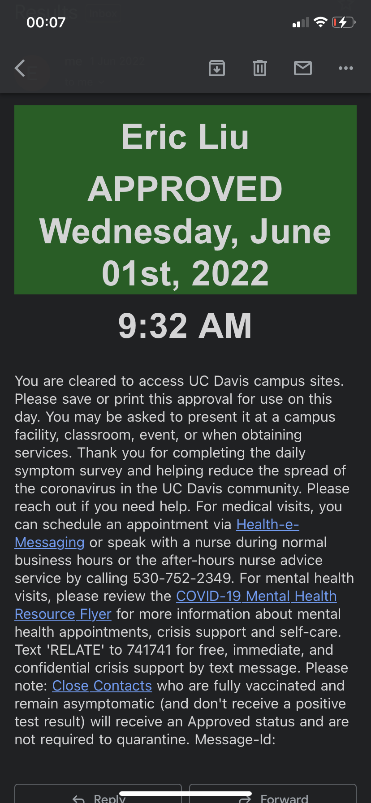

# covid_thing
This is a pretty goofy C++ "web application" I made to generate fake COVID symptom surveys,
when I was too lazy to fill them out due to bad WiFi (and health servers).

This isn't runnable without setting up a Google app endpoint, but I don't feel like documenting it.
You should be able to figure out how it works based on what files are missing from `strings/` (in the gitignore).

# PSA
Don't use WinHttp or HttpApi. They both suck and are really unintuitive as HTTP client and server libraries.

# Code structure
main.cxx:
- Requests OAuth token: from refresh if available, otherwise uses initial OAuth logic.
- Sends email

oauth.cxx:
- On initial token request:
    - Opens the browser to a Google API link and spawns an HTTP server to listen for a response.
- On refresh request:
    - Sends an API request to a Google endpoint to get an access token.

email.cxx:
- Formats a date using libc's strftime and friends
- Concatenates a MIME email body
- Base64 encodes it with some WinAPI routine
- Sends it off to Google's Gmail API

# Output
